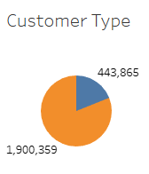
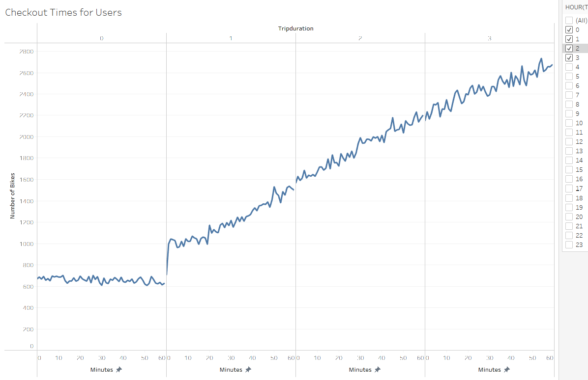
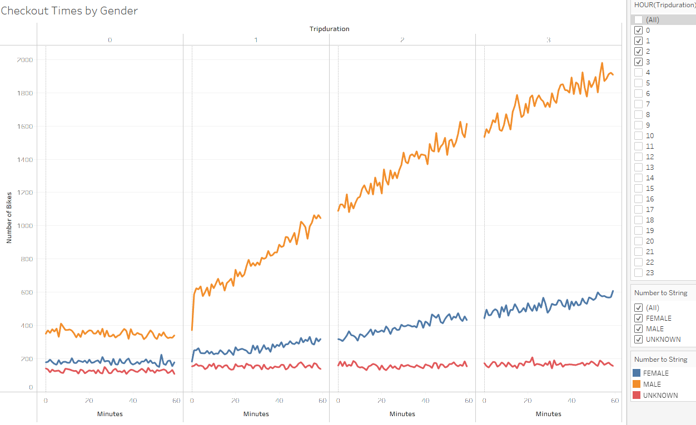
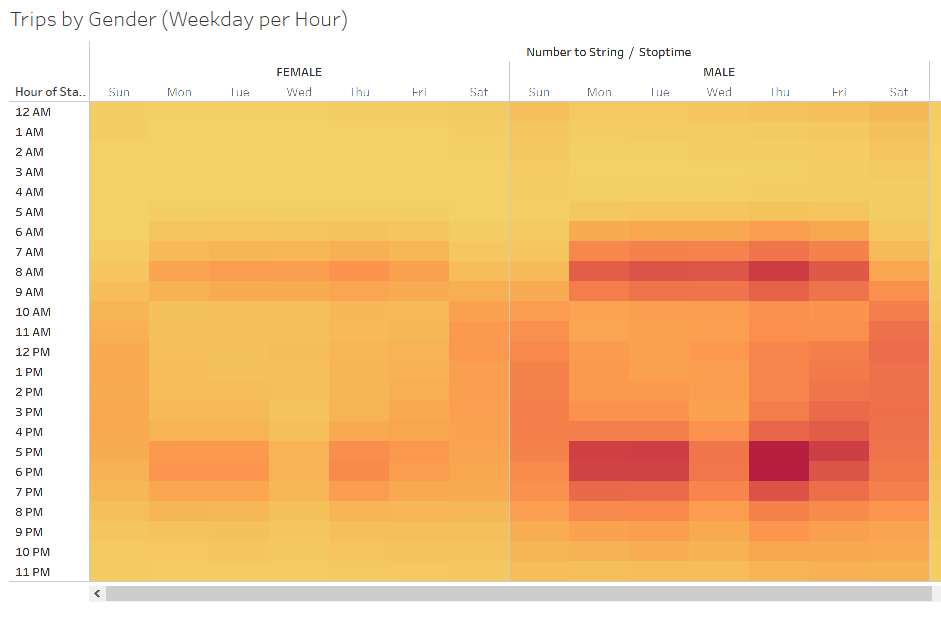
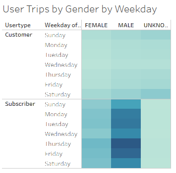
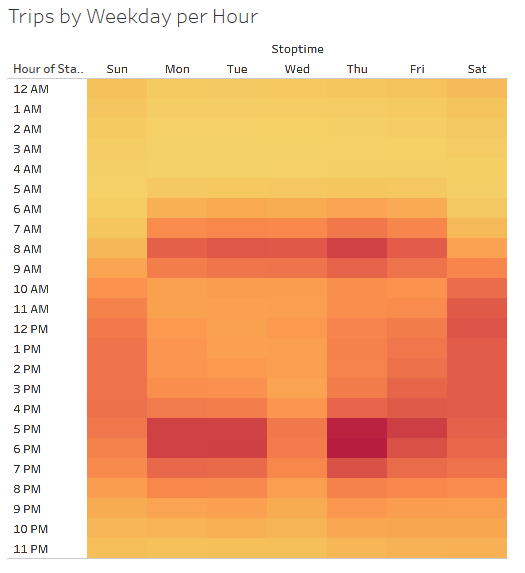
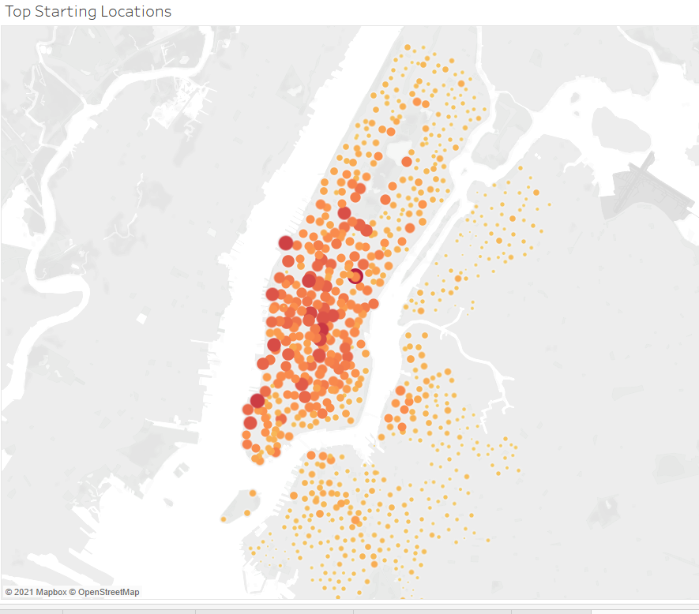

# Bikesharing
[https://public.tableau.com/app/profile/taylor.takanishi/viz/Bikesharing_Challenge_16233834495650/NewYorkCitiBikeData](https://public.tableau.com/app/profile/taylor.takanishi/viz/Bikesharing_Challenge_16233834495650/NewYorkCitiBikeData "link to dashboard")
## Overview
The purpose of this analysis is to evaluate bikesharing data from Citi Bike in New York City to determine if a bikesharing business in Des Moines, Iowa will be successful. Through this analysis, we can see that bike sharing in Des Moines can be successful and will be a great addition to the culture of the city. We will be using this analysis to show the viability of the business to potential investors.
## Results
#### Customer Type
- Most users are subscribers, which means Des Moines does not need to rely on tourists to be successful. Here, subscribers are orange and customers are blue. 
#### Checkout Times for Users
- Bikes aren't just checked out for a short period of time; users tend to check out bikes for longer than two hours. 
#### Checkout Times by Gender
- Males tend to checkout bikes more often for longer periods of time. 
#### Trips by Gender (Weekday per Hour)
- Males tend to use bikes more during the commuting hours. 
#### User Trips by Gender by Weekday
- The subscriber base is mainly males. 
#### Trips by Weekday per Hour
- Bikes are most popular during commuting hours, with surges mid-morning to mid-afternoon on the weekends. 
#### Top Starting Locations
- Manhattan seems to be the most popular starting location. 
## Summary
Des Moines is a great city to start a bikesharing business. Male subscribers are the most popular user, and subscribers are more popular users than customers. This indicates that while tourists use the bikesharing program, they are not depended on to provide for the success of the business. Two additional visualizations that should be added are commuting routes for Des Moines and a closer look at the starting locations of the New York City bikesharing data. A visualization should be created that shows the users compared to the starting and ending points of the data. This will show if the popularity in Manhattan is due to tourists or commuters.
